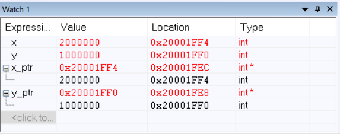
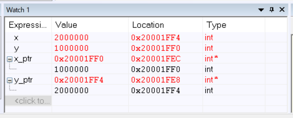
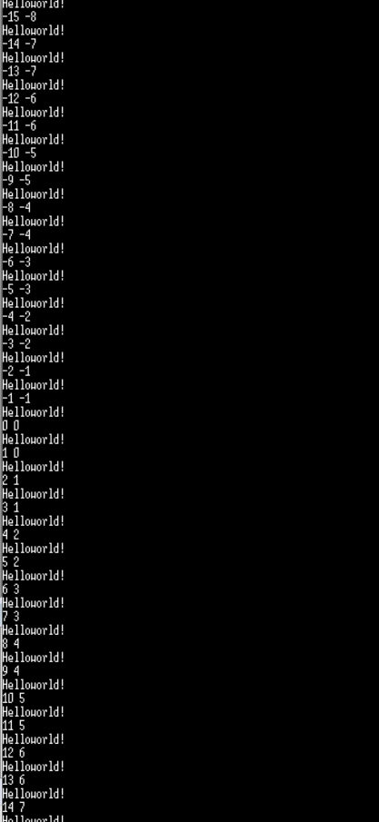

# EMBSYS 310 - Assignment05

## Problems:

1. Create a function in \"C\" that allows swapping of two pointers.
   
   1. Explain what the \"main\" function does in order to setup the input arguments prior to calling the swap_pointer() function?
      
      After program entries the main function, main function stores LR into the stack, and the operation is compatiable the rule in AAPCS, \\"caller has to save LR if it will call callee\". Then, beforing calling \"swap\_pointer\" function, the main function prepares passing two addresses of a pointer to int, which are the address of x_ptr and y\_ptr. The main function assigns both address of the two pointers to R0 and R1 seperately to pass them to swap\_pointer function. Both addresses are calculated from \"SP\" because they are local variables.
      
      ```
      main:
      0x800'0040:    PUSH    {R3-R7, LR}       // save LR
      ...
      swap_pointers(&x_ptr, &y_ptr)
      0x800'0052:    MOV     R1, SP            // address of y_ptr
      0x800'0054:    ADD     R0, SP, #0x4      // address of x_ptr
      0x800'0056:    BL      swap_pointers
      ```
   
   2. The value of R0 is the address of x\_ptr , and the value of R1 is the address of y\_ptr. See the picture \#1 and \#2.
   
   3. Screen shots
      
      1. Before entering swap\_pointers function)
         
         
      
      2. After entering swap_pointers function
         
         

2. Divide Two in assembly module)
   
   
