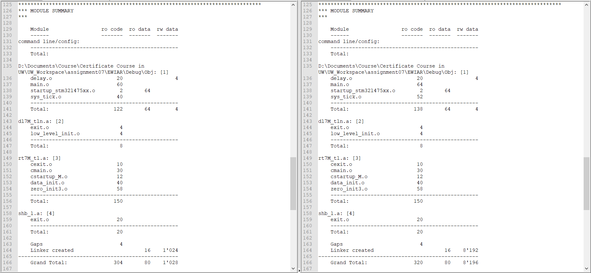
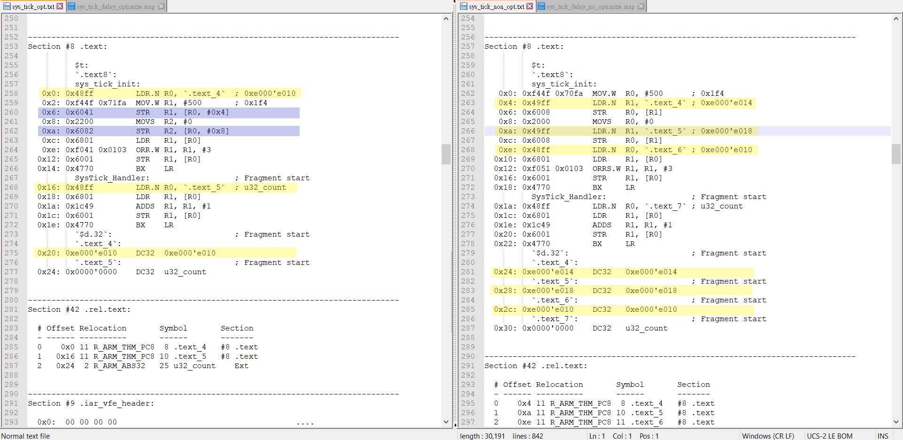

# EMBSYS 310 ASSIGNMENT 07

1. Blinking LED:
   
   - Purpose: practice writing the vector table, setting up system tick, and designing delay function
   - [main.c](./Code/Src/main.c)
   - [startup_stm32l475xx.c](./Code/Src/startup_stm32l475xx.c)
   - [sys_tcik.h](./Code/Inc/sys_tick.h)
   - [sys_tick.c](./Code/Src/sys_tick.c)
   - [delay.h](./Code/Inc/delay.h)
   - [delay.c](./Code/Src/main.c)

2. Generate the map file for your program and provide details on:
   
   1. How much total ROM your program is occupying?
      
      The program occupies 400 bytes in ROM. 
   
   2. How much total RAM your program is using?
      
      The program uses 8196 bytes in RAM.
   
   3. What part of your program is using the most ROM?
      
      In ROM, there are a read-only code region and a read-only data region. The code occupies 320 bytes, and the read-only data occupies 80 bytes.
   
   4. What part of your program is using the most RAM?
      
      In RAM, the global variable "count" in sys_tick.c occupies 4 bytes, and the left memory is 8 kilobytes stack.

3. Bonus: Is there anything that can be done to optimize the usage of ROM or RAM resources? Explain any options.
   
   1. Answer:
      
      First, I set compiler optimization high for size. The compiler will reduce useage of literal pools and turn to access some registers by pre-index with offset. Second, I reduce the stack size from 8 Kbytes to 1 Kbytes or even less because the program does not use whole memory in the stack. The stack size  can be set in the link configuration.
   
   2. Comparison - Optimized v.s. Non-optimzied
      
      1. Comparison of map files
         
         
      
      2. Comparison of disassembly sys_tick.o
         
         
